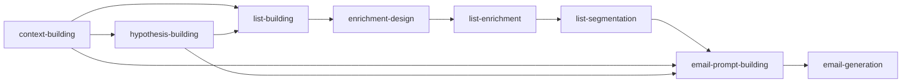

GTM Skills are reusable prompt templates for Claude Code that automate outbound GTM workflows. Each skill is a self-contained module that handles a specific part of the campaign process—from research to email generation to sending.

## What Are GTM Skills?

Skills are prompt templates that give Claude Code specialized instructions for specific tasks. Unlike general coding assistants, skills encode domain expertise: what to ask, how to reason, which APIs to call, and where to save outputs.

<Tip>
Skills are **templates**, not hardcoded tools. Fork them, adapt to your workflow, swap out the vendors you don't use. The skill patterns are the value—the specific integrations are up to you.
</Tip>

## Skill Architecture

Each GTM skill follows a consistent structure:

### Skill Components

<CardGroup cols={2}>
  <Card title="SKILL.md" icon="file-lines">
    The main prompt template containing:
    - Trigger phrases that activate the skill
    - Step-by-step workflow instructions
    - Decision trees and branching logic
    - Cross-skill references
  </Card>
  <Card title="references/" icon="folder">
    Supporting documentation:
    - API specs and schemas
    - Prompt patterns and templates
    - Data libraries and examples
  </Card>
</CardGroup>

### How Skills Activate

Skills automatically trigger when you use specific phrases:

```bash Example Triggers
# Context building
"Build company context" → context-building skill

# List building  
"Find companies similar to acme.com" → list-building skill

# Email generation
"Generate emails from this list" → email-generation skill
```

### Skill Independence

No required sequence. Use one skill or combine several:

- **Standalone**: Run `list-building` alone to get a prospect list
- **Sequential**: `context-building` → `list-building` → `email-generation`  
- **Selective**: Skip `market-research` if you know your vertical

## Plan Mode

When you describe a campaign goal, Claude enters **plan mode**:

<Steps>
  <Step title="Research Phase">
    Claude reads your website, win cases, or uploaded data to understand your ICP and value prop.
  </Step>
  <Step title="Question Phase">
    Asks clarifying questions about:
    - Target vertical and geography
    - Campaign goals (volume vs. quality)
    - Existing context (do you have a context file?)
  </Step>
  <Step title="Plan Proposal">
    Presents a multi-step campaign plan:
    ```
    1. Build context file from your website
    2. Generate hypothesis set for enterprise SaaS
    3. Run lookalike search from seed companies
    4. Design enrichment columns for qualification
    5. Generate tier-aware emails
    ```
  </Step>
  <Step title="Execution">
    After you approve, Claude executes the plan step-by-step, invoking each skill in sequence.
  </Step>
</Steps>

### Plan Mode Triggers

These prompts activate plan mode:

<CodeGroup>
```bash From Website
I'm building www.example.com.
Read my website, figure out my ICP,
and draft a plan for an outbound campaign.
```

```bash From Win Case  
I'm building www.example.com.
One customer is www.customer.com.
Find similar companies and plan a campaign.
```

```bash From Data
Here's a list of my won deals [attach CSV].
Analyze them and find similar companies to target.
```
</CodeGroup>

## The Global Context File

All skills read from a single source of truth:

```
claude-code-gtm/context/{company}_context.md
```

This file captures:

<CardGroup cols={2}>
  <Card title="Product Info" icon="box">
    What you build, value prop, key numbers, email-safe positioning
  </Card>
  <Card title="Voice Rules" icon="microphone">
    Sender identity, tone, banned words, language level  
  </Card>
  <Card title="ICP Profiles" icon="users">
    Target company sizes, roles, geographies, anti-patterns
  </Card>
  <Card title="Win Cases" icon="trophy">
    Past customers, what worked, concrete outcomes
  </Card>
  <Card title="Proof Library" icon="bookmark">
    Pre-written proof points mapped to audiences and hypotheses
  </Card>
  <Card title="Campaign History" icon="clock-rotate-left">
    Past campaigns, reply rates, learnings
  </Card>
  <Card title="Hypotheses" icon="flask">
    Active/validated/retired pain hypotheses
  </Card>
  <Card title="DNC List" icon="ban">
    Competitors, partners, opt-outs to exclude
  </Card>
</CardGroup>

<Info>
The context file is created once via `context-building` and updated continuously with campaign learnings. See [Context Files](/concepts/context-files) for detailed schema.
</Info>

## Skill Composition

Skills reference each other's outputs:



**Example flow:**
1. `context-building` creates the context file
2. `hypothesis-building` reads ICP and win cases → generates hypotheses  
3. `list-building` reads hypotheses → runs searches → uploads to table
4. `enrichment-design` reads hypotheses → designs columns
5. `list-enrichment` runs columns on the table
6. `email-prompt-building` reads context + research → generates template
7. `email-generation` reads template + CSV → generates emails

## Where Skills Live

Once installed, skills are stored globally:

```bash
~/.claude/skills/
```

Install once, use everywhere. They become available across all your projects.

## Next Steps

<CardGroup cols={2}>
  <Card title="End-to-End Workflow" icon="diagram-project" href="/concepts/workflow">
    See how skills chain together in a full campaign
  </Card>
  <Card title="Context Files" icon="file-lines" href="/concepts/context-files">
    Deep dive on the global context file structure
  </Card>
  <Card title="Campaign Artifacts" icon="folder-tree" href="/concepts/campaign-artifacts">
    Understand the directory structure and file organization
  </Card>
  <Card title="Available Skills" icon="grid" href="/skills/overview">
    Browse all 13 skills and their use cases
  </Card>
</CardGroup>